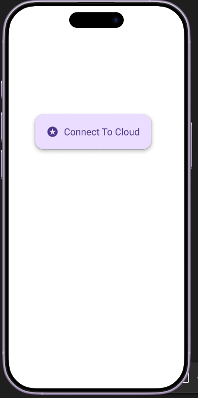
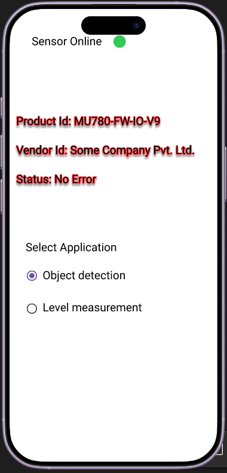

# Requirement: Sensor's iOS Client App - Stage 1 PoC

## 1. Purpose

The purpose of the Stage 1 iOS app is to demonstrate that a mobile client can connect to the the sensor's cloud, fetch its data, display live process data, and read/write basic sensor parameters.

This version is a proof of concept and will use one predefined sensor type: an ultrasonic sensor.

---

## 2. Scope 

### In Scope

- Connect to cloud backend
- Fetch sensor information from cloud
- Display sensor status
- Display live process data
- Read sensor parameters
- Write sensor parameters
- Support application-specific UI for:
  - Object Detection
  - Fluid Level Measurement

### Out of Scope

- Automatic discovery of all customer sensors
- User account management
- Complex device onboarding
- Multi-sensor dashboard
- Role-based permissions
- Historical data visualization
- Alarm management
- Dynamic UI generation from cloud

---

## 3. Target Platform

- iOS app
- iPhone first
- Portrait mode only for Stage 1

---

## 4. User Flow

```text
Open App
   |
   v
Connect to Cloud
   |
   v
Load Ultrasonic Sensor
   |
   v
Select Application
   |
   +--> Object Detection UI
   |
   +--> Fluid Level Measurement UI
```

## 5. Cloud Services

- Service is available on Azure
- The sensor functions as IoT device on cloud
- gRPC makes the data available, but no data is saved on the cloud
- Data is exchanged using remote procedure calls
- Stage 1 has fixed device in service provider's cloud
- Client has no option to configure own cloud
- No tenant model is available in Stage 1 to keep implementation simple



